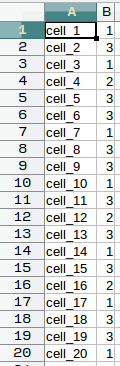
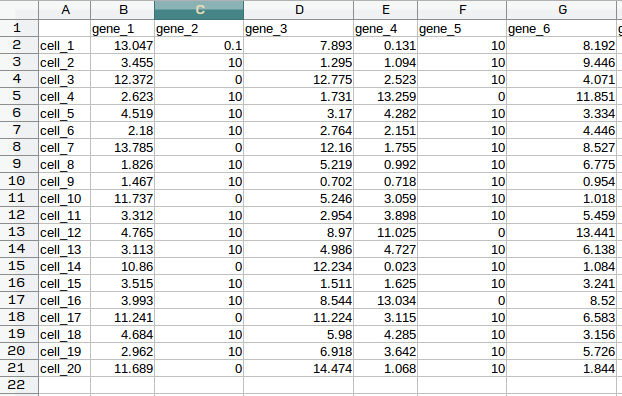

.. |tsne| image:: _static/tsne_format.png

Input formatting
-----------------

Before you use COMET with gene expression data, your data should be
formatted into 3 files as shown below. The tables below are shown in excel format 
for ease of view, but files should be given as plain text files.

* ``markers.txt``: The expression matrix table stored as a TXT file (.txt). The first row
  of the table lists cell names, while the first column
  lists genes. The cell at the very top left should be
  blank. Each element in the rest of the table should contain a
  numerical gene expression value, corresponding to the row/cell and
  column/gene of the element. Tab delimited only. COMET does not do any preprocessing on 
  this file.
  
  |markers|
  
* ``tsne.txt``: The TSNE data stored as a TXT file (.txt). Consists of three columns separated by tabs, 
the first column is cell name (the same as those in
  ``markers.txt``), the second is the tSNE_1 value for the cell, and
  the third is the tSNE_2 value for the cell. Tab delimited only.
  
  |tsne|
  
* ``cluster.txt``: The cluster assignments for cells stored as a TXT file (.txt).
The first column is cell name (consistent with
  ``markers.txt`` and ``tsne.txt``) and the second is the cluster of
  which the cell is a member. Cluster numbers should start from 1 and
  cell names should avoid using punctuation marks. Tab delimited only.
  
  |cluster|
  

* ``gene_list``: A list of genes to use for filtering in your
  data. Should be comma delimited.

.. toctree::
                                                                  
